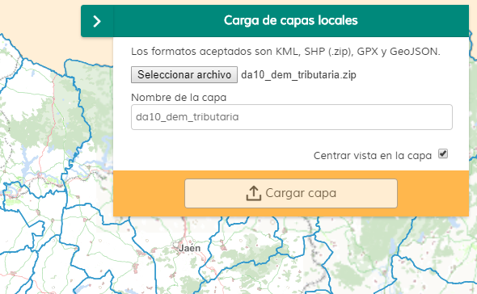

# Local layers

[](https://github.com/sigcorporativo-ja/Mapea4-dev-webpack)  

## Descripción

 Plugin de [Mapea](https://github.com/sigcorporativo-ja/Mapea4) desarrollado por el [Instituto de Estadística y Cartografía](https://www.juntadeandalucia.es/institutodeestadisticaycartografia) para la carga de capas locales.
 
 Soporta los formatos KML, SHP (.zip), GPX y GeoJSON.

 

 
## Recursos y uso

- js: localayers.ol.min.js
- css: localayers.min.css

```javascript
// crear el plugin
var mp = new M.plugin.LocalLayers();

// añadirlo al mapa
myMap.addPlugin(mp);
});
```  